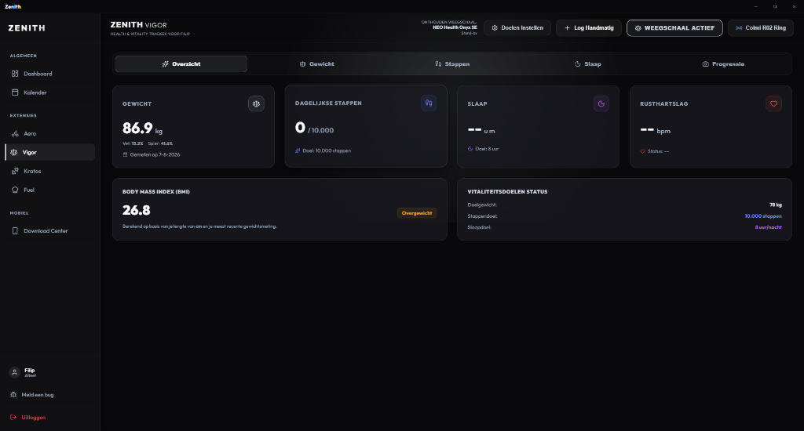
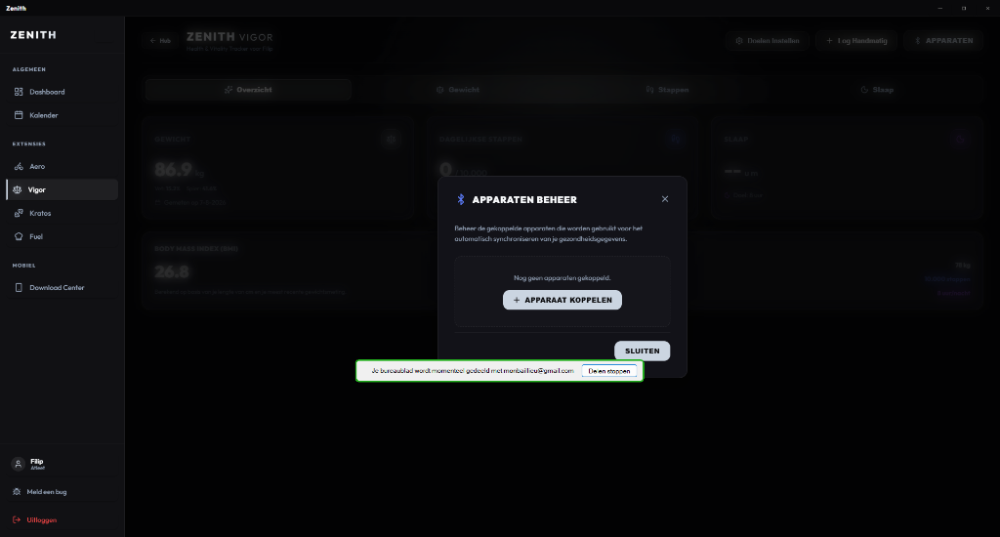
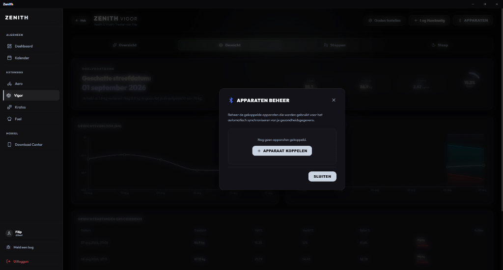

# 🌌 Zenith Ecosystem

[](https://github.com/filipmonbaillieu24-prog/Zenith/releases)
[](https://github.com/filipmonbaillieu24-prog/Zenith/actions)
[](LICENSE)

An all-in-one, highly integrated, and premium health, fitness, and athletic performance tracking suite. Built with a modern dark aesthetic, featuring scientific metrics, native BLE sensor integrations, machine learning-driven recovery scores, and a modular architecture.

---

## 📸 App Previews

<div align="center">
  
  <p><i>Figure 1: Central Dashboard displaying CTL/ATL/TSB physiological metrics and real-time AI Recovery Score</i></p>
  
  <br/>
  
  
  <p><i>Figure 2: Health and Weight Tracking Interface with automated BLE scale integrations</i></p>

  <br/>
  
  
  <p><i>Figure 3: Strength Training Logger showing progression metrics and exercise libraries</i></p>
</div>

---

## 🛠️ Architecture

Zenith is organized as a monorepo containing a Rust-backed Desktop Hub, five distinct modular extensions (Vite/React), and native mobile applications:

| Component | Path | Tech Stack | Description |
| :--- | :--- | :--- | :--- |
| **Zenith Hub** | `apps/zenith-hub` | Tauri v2, React, TypeScript | The native desktop wrapper (Windows/macOS). Handles local storage, BLE listeners, user authentication, and coordinates the extensions inside sandboxed iframes. |
| **Zenith Aero** | `apps/zenith-aero` | React, Tailwind, Leaflet | Cardio and Cycling tracker. Imports FIT files, charts heart rate zones, generates heatmaps, and tracks stress loads. |
| **Zenith Vigor** | `apps/zenith-vigor` | React, Supabase | Health metrics tracker. Interacts with BLE scales to sync weight, tracks daily steps, logs sleep quality, and computes recovery scores. |
| **Zenith Kratos** | `apps/zenith-kratos` | React, TypeScript | Desktop strength training interface. Manages programs, workout history, and synchronizes with mobile. |
| **Zenith Fuel** | `apps/zenith-fuel` | React, Tailwind | Nutrition, caloric balance, and macronutrient logging system. |
| **Kratos Mobile** | `apps/zenith-kratos-pilot` | Android Native (Kotlin), Jetpack Compose | Native Android logger. Includes progressive warm-up sets, dynamic auto-regulation calculations, and offline capabilities. |

---

## ✨ Key Features

### 📈 Physiological Load Balance (PMC)
Implements standard fitness algorithms (**CTL** - Chronic Training Load, **ATL** - Acute Training Load, and **TSB** - Training Stress Balance) to project cardiovascular fitness progression. Calculates training stress scores dynamically from cycling power/heart rate data and strength workouts to forecast form up to 35 days in the future.

### 🧠 AI Recovery Score
Calculates a real-time recovery index using an integrated Machine Learning algorithm. Combines:
* **Physiological stress** (ATL & TSB trends).
* **Sleep quality & duration** (captured natively).
* **Activity indices** (daily step count vs. targets).
* **Vitals** (bodyweight changes).

### 📶 BLE Auto-Pairing
Natively connects to Bluetooth Low Energy (BLE) health devices such as the **Neo Health Onyx SE Scale**. As soon as a user steps on the scale, the desktop app registers the weight event, stores it inside Supabase, and updates all active dashboards in real-time.

### 🏋️ Dynamic Warmup & Scientific Autoregulation (Kratos)
The mobile companion app uses advanced strength training calculations:
* **Dynamic Warmup Scaling:** Automatically computes progressive warm-up sets (percentages like 50% & 75%) based on the target weight of your first working set. Updates live as you type or adjust weights.
* **RIR-based 1RM Tracking:** Uses Reps in Reserve (RIR) and completed sets to calculate Estimated 1RM ($e1RM$) via scientific formulas, dynamically updating target weights for subsequent working sets while filtering out warmups to prevent skewing data.

---

## 💻 Local Development

### Prerequisites
* **Node.js** (v20+)
* **Rust & Cargo** (latest stable)
* **Android Studio & SDK** (for mobile application)
* **Tauri v2 CLI** (`npm install -g @tauri-apps/cli`)

### Quick Start
1. Clone the repository:
   ```bash
   git clone https://github.com/filipmonbaillieu24-prog/Zenith.git
   cd Zenith
   ```

2. Install dependencies:
   ```bash
   npm install
   ```

3. Run the complete ecosystem in development mode:
   ```bash
   npm run zenith
   ```
   *This starts the Tauri dev server for the Hub, alongside Vite dev servers for Aero, Vigor, Kratos, and Fuel concurrently.*

---

## 🚀 CI/CD Build & Releases

The project includes a robust **GitHub Actions** release workflow located at `.github/workflows/release.yml`.

Whenever a new version tag (e.g. `v0.1.1`) is pushed:
1. It spins up a Windows runner (`windows-latest`) and a macOS runner (`macos-latest`).
2. Compiles all React sub-applications and copies assets using a cross-platform Node copy utility (`copy-builds.js`).
3. Compiles native production desktop builds using Tauri v2.
4. Cryptographically signs the updates using minisign keys (`TAURI_SIGNING_PRIVATE_KEY`).
5. Generates the `updater.json` file to power automatic, secure in-app updates.
6. Publishes the **Windows `.exe` installer** and **macOS `.dmg` desktop app** under the GitHub Releases page.

---

## ⚖️ License

This project is private and proprietary. All rights reserved.
