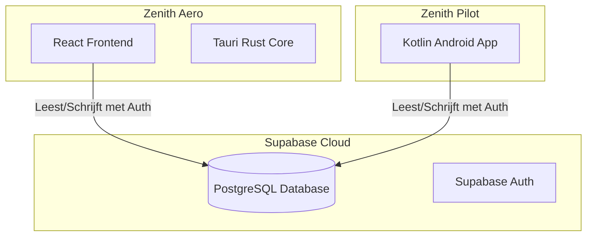

# Zenith Ecosysteem - Architectuurgids

Welkom bij de algemene architectuurgids voor het **Zenith** ecosysteem. Zenith is een intelligent platform voor wielrenners om routes te plannen, trainingen te analyseren en live in-ear coaching te ontvangen.

---

## 1. De Componenten van het Ecosysteem

Het Zenith-ecosysteem bestaat momenteel uit twee hoofd-applicaties die nauw met elkaar samenwerken via een centrale cloud-database:

### 🚀 Zenith Aero (Desktop-app)
* **Locatie in monorepo**: `apps/zenith-aero`
* **Technologie**: React + TypeScript + Vite + Tauri (desktop wrapper).
* **Rol**: 
  - **Routeplanner**: Genereert wind-gecorrigeerde en heuvelachtige trainingsroutes op basis van doelen en weersvoorspellingen.
  - **Coach-paneel**: Analyseert ritten, beheert de fysiologische PMC (Performance Management Chart) simulatie en genereert gepersonaliseerde workouts.
  - **Kalender**: Plannen en inplannen van trainingen met en zonder routes.

### 🚴 Zenith Pilot (Android-app)
* **Locatie in monorepo**: `apps/zenith-pilot`
* **Technologie**: Kotlin + Jetpack Compose + Ktor + Supabase Kotlin SDK.
* **Rol**:
  - **Ritcomputer**: Gemonteerd op het stuur van de fiets. Toont realtime metrics (snelheid, vermogen, hartslag, cadans).
  - **Sensorkoppeling**: Verbindt direct met BLE-sensoren (hartslagbanden, vermogensmeters, cadanssensoren).
  - **Audio Coach**: Levert live in-ear audiobegeleiding (via spraaksynthese) op basis van de actieve interval-workout en snelheidsdoelen van de gekoppelde route.

---

## 2. Data-synchronisatie en Cloud Architectuur

Beide applicaties zijn volledig gekoppeld via een gedeelde **Supabase** instantie in de cloud.

### Datastroom
1. **Planning**: De gebruiker genereert of selecteert een workout en route in **Aero**. Deze wordt opgeslagen in de tabel `planned_workouts` (met referentie naar `routes`).
2. **Synchronisatie**: **Pilot** haalt de geplande workouts voor vandaag op uit `planned_workouts` en laadt de bijbehorende routepunten uit `routes` in voor navigatie en coaching.
3. **Registratie**: Tijdens de rit slaat **Pilot** de sensordata en GPS-locaties op. Na afloop wordt de rit geüpload naar `rides`.
4. **Analyse**: **Aero** detecteert de nieuwe rit in `rides`, berekent de werkelijke TSS (Training Stress Score) en werkt de PM-grafiek (Fitness, Fatigue, Form) bij.

---

## 3. Richtlijnen voor Gedeelde Configuratie (Single Source of Truth)

Om te garanderen dat alle huidige en toekomstige apps binnen het ecosysteem naadloos met elkaar communiceren, maken we gebruik van de centrale configuraties in de `/shared` map:

### 🔑 Database-connectie (`shared/supabase-config.json`)
Dit bestand bevat de `supabaseUrl` en `supabaseAnonKey`. 
* **Aero** laadt deze tijdens het bouwen in via de `.env` configuratie.
* **Pilot** laadt deze in via Gradle-build properties (waarbij hardcodering in de Kotlin-broncode wordt vermeden).
* **Toekomstige Apps**: Moeten dit bestand parsen of inladen tijdens hun build- of runtime-proces om verbinding te maken met dezelfde database.

### 🎨 Styling en Thema (`shared/design-tokens.json`)
Dit bestand specificeert de universele stylingtokens (kleuren, lettertypes, spacing en vormen) van het Zenith-merk.
* **Aero** gebruikt deze tokens om zijn CSS-variabelen in `index.css` te definiëren.
* **Pilot** gebruikt deze tokens in `Color.kt` en `Theme.kt` binnen Jetpack Compose.
* **Toekomstige Apps**: Moeten dit bestand gebruiken om hun UI-thema's te configureren, zodat de visuele stijl (zoals het neon-groene accent `#39ff14` of de donkere achtergrond `#09090b`) op alle platforms identiek is.

---

## 4. Lokale Synchronisatie (Offline / APK Distributie)

Naast de cloud-koppeling beschikt Aero over een ingebouwde **Zenith Hub**. 
* **Doel**: Het direct lokaal downloaden van de Pilot-app op een Android-apparaat zonder tussenkomst van een app store.
* **Werking**: Aero start een lokale webserver (poort `1420`). Via de **PilotPanel** pagina in Aero wordt het lokale IP-adres van de PC opgehaald via een Tauri-commando (`get_local_ip`). Er wordt een QR-code getoond die verwijst naar `http://<lokaal-ip>:1420/app-debug.apk`. 
* Wanneer de Android-telefoon (verbonden met hetzelfde wifi-netwerk) de QR-code scant, wordt de APK rechtstreeks vanaf de pc gedownload en geïnstalleerd.
